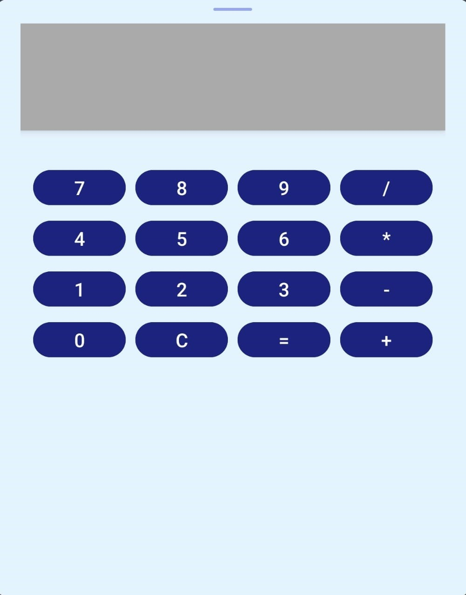

<h1 align="center">Calculadora</h1>

## Project
This project consists of an Android application that implements a basic calculator. The application allows users to perform arithmetic operations such as addition, subtraction, multiplication, and division. With a simple and intuitive interface, users can easily input their numbers and see the results in real-time. The application also includes basic functionality to clear the input and reset the calculator.

## Layout
<div align="center">
  
</div>

## Technologies Used
- **Programming Language:** Kotlin
- **Development Environment:** Android Studio

## Code Author
```kotlin
fun main() {
    println("Code by Gabriela Oliveira!")
}
